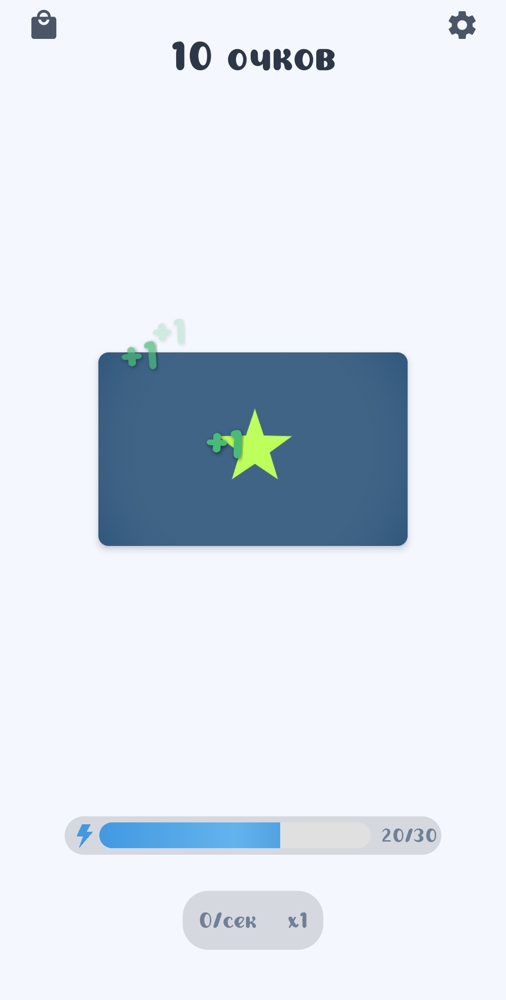
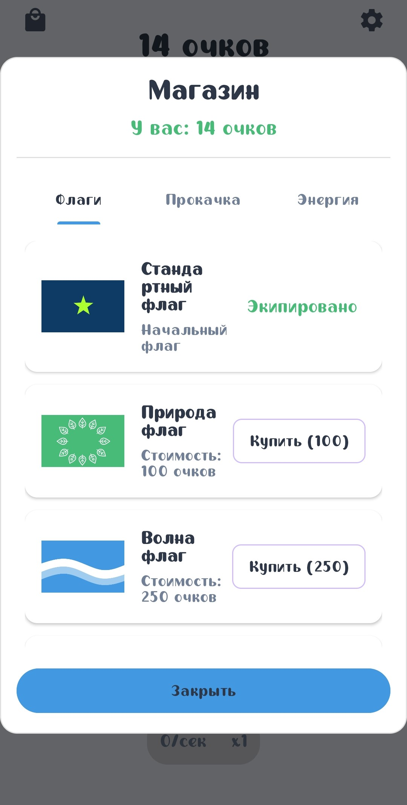
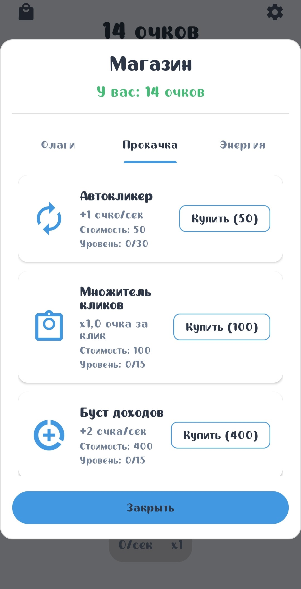
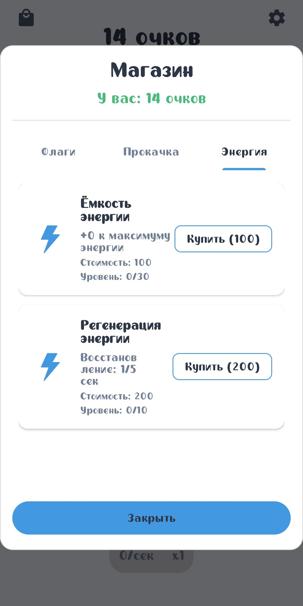

# RussianClicker v2.0 🚩

**Новая версия кликера на Kotlin**

## 📱 О проекте

RussianClicker v2.0 - это полностью переписанная версия классического кликера, теперь на чистом Kotlin для Android. Проект был создан для изучения Kotlin и демонстрации базовых механик мобильной игры.

**История:**
- v1.0 - Первая версия на Godot Engine (учебный проект)
- v2.0 - Полный рефакторинг на Kotlin с улучшенной архитектурой

## 🎮 Особенности

- ✅ **Кликер механика** - Основная игровая механика
- ✅ **Система улучшений** - Покупка и апгрейд объектов
- ✅ **Прогрессия** - Развитие с нарастающей сложностью
- ✅ **Экономика игры** - Баланс цен и доходов
- ✅ **Локализация** - Поддержка русского языка
- ✅ **Material Design** - Современный интерфейс

## 🛠️ Технологии

- **Kotlin** - Основной язык разработки
- **Android Jetpack**:
  - ViewModel
  - LiveData
  - Room Database (для сохранения прогресса)
  - Data Binding
- **Material Components** - UI элементы
- **Coroutines** - Асинхронные операции
- **Koin** - Внедрение зависимостей

## 🎯 Игровая механика

### Основные элементы:

#### 1. **Клики** 👆 - Основной способ заработка
- Нажимайте на центральный флаг для получения очков
- Каждый клик приносит базовый доход
- Доход от клика можно увеличивать с помощью улучшений

#### 2. **Улучшения** ⚡ - Автоматизируют процесс
- **АвтоКликеры** - Кликают автоматически каждую секунду
- **Множители** - Увеличивают доход от каждого клика

## 📊 Скриншоты

### Главный экран

### Магазин покупки флагов  

### Система улучшений кликов

### Система улучшений энергии

## 📱 Соцсети
[[YouTube](https://www.youtube.com/@pravda_sempai)
[[Rutube](https://rutube.ru/channel/41737058/)
[[VK](https://vk.com/pravdasempai)
[[Telegram](https://t.me/PRAVDASEMPAI)
